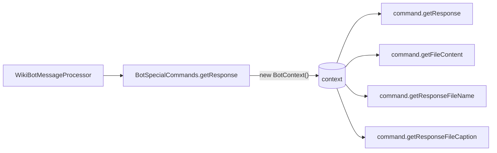

## Goal

Add a per-call `BotContext` to the four `BotCommand` methods that participate in a single special-command invocation. Same instance is constructed once in [`BotSpecialCommands.getResponse`](src/main/kotlin/com/dv/telegram/command/BotSpecialCommands.kt) and threaded into:

- `getResponse(text, bot, update, context)`
- `getFileContent(text, bot, update, context)`
- `getResponseFileName(context)`
- `getResponseFileCaption(context)`

This unblocks the pending [detailed-response-caption plan](ai/cursor/detailed-response-caption_3245e921.plan.md): `ExportNotionPageTreeToExcel.getFileContent` can stash page id/title/start/end into `context`, and `getResponseFileCaption` can read them.

## Lifetime / placement



- One `BotContext` per special-command invocation.
- Created empty inside `BotSpecialCommands.getResponse`, right before `command.getResponse(...)`.
- Not exposed outside `BotSpecialCommands` (regular Google-Sheet command flow and `WikiBotMessageProcessor` stay unchanged).

## Interface change — [`BotCommand.kt`](src/main/kotlin/com/dv/telegram/command/BotCommand.kt)

Add `context: BotContext` as the last parameter on all four methods:

```kotlin
fun getResponse(text: String, bot: WikiBot, update: Update, context: BotContext): String
fun getFileContent(text: String, bot: WikiBot, update: Update, context: BotContext): InputStream?
fun getResponseFileName(context: BotContext): String
fun getResponseFileCaption(context: BotContext): String
```

Update default impls in [`BasicBotCommand.kt`](src/main/kotlin/com/dv/telegram/command/BasicBotCommand.kt) to match (parameter added; bodies unchanged).

## Call site — [`BotSpecialCommands.kt`](src/main/kotlin/com/dv/telegram/command/BotSpecialCommands.kt) `getResponse(...)`

Replace existing block around lines 47–85:

```kotlin
val context = BotContext()

val response = command.getResponse(text, bot, update, context)
val useMarkdownInResponse = command.useMarkdownInResponse()

return if (command.returnFileInResponse()) {
    val responseFileContent = try {
        command.getFileContent(text, bot, update, context)
            ?: error("Command ${command.javaClass.simpleName} has returnFileInResponse == true, but getFileContent returned null.")
    } catch (e: CommandException) { ... }

    SpecialCommandResponse.withResponse(
        response,
        useMarkdownInResponse,
        command.returnFileInResponse(),
        command.getResponseFileName(context),
        command.getResponseFileCaption(context),
        responseFileContent,
    )
} else {
    SpecialCommandResponse.withResponse(response, useMarkdownInResponse)
}
```

Order matters: `getResponse` and `getFileContent` may populate `context` keys that `getResponseFileName` / `getResponseFileCaption` later read.

## Command overrides (signature update only, no behavior change)

Add `context: BotContext` parameter to every existing override. None of these need to read the context yet; this is purely a signature migration.

- File-returning commands (also accept `context` on the name/caption overrides):
  - [`ExportNotionPageTreeToExcel.kt`](src/main/kotlin/com/dv/telegram/command/ExportNotionPageTreeToExcel.kt)
  - [`AllBotsGetSuccessfulRequests.kt`](src/main/kotlin/com/dv/telegram/command/AllBotsGetSuccessfulRequests.kt)
  - [`AllBotsGetFailedRequests.kt`](src/main/kotlin/com/dv/telegram/command/AllBotsGetFailedRequests.kt)

- Text-only commands (only `getResponse` override changes):
  - `Start`, `HelpCommand`, `ListCommands`, `ListAdmins`, `GetEnvironment`, `ReloadFromGoogleSheet`, `CityChatsValidate`, `CityChatsExportToNotion`, `ListSettings`, `HelpSetting`, `GetSetting`, `SetSetting`, `GetTabConfigs`, `SetTabConfigs`, `GetStatistics`, `GetSuccessfulRequests`, `GetFailedRequests`, `ClearSuccessfulRequests`, `ClearFailedRequests`, `GetLastMessageLog`, `AllBotsList`, `AllBotsReloadFromGoogleSheet`, `AllBotsGetTabConfigs`, `AllBotsGetStatistics`, `GetChatInfo`, `GetUserInfo`.

## Nested calls inside `AllBots*` commands

`AllBotsGetSuccessfulRequests`, `AllBotsGetFailedRequests`, `AllBotsGetStatistics`, and `AllBotsReloadFromGoogleSheet` invoke another command's `getResponse(...)` directly (e.g. [AllBotsGetSuccessfulRequests.kt:54-57](src/main/kotlin/com/dv/telegram/command/AllBotsGetSuccessfulRequests.kt)):

```kotlin
contextBot.specialCommands.getSuccessfulRequestsCommand
    .getResponse("", contextBot, update, context)
```

Pass through the same `context` the outer command received. Reusing one instance is safe — these inner commands don't read from it.

## Tests to update

- [`BotGetResponseTest.kt`](src/test/kotlin/com/dv/telegram/BotGetResponseTest.kt) lines 30 and 118 — pass `BotContext()` to `start.getResponse(...)` / `getEnvironment.getResponse(...)`.
- [`BotStatisticsTest.kt`](src/test/kotlin/com/dv/telegram/statistics/BotStatisticsTest.kt) line 72 — same fix.

## Out of scope

- Pre-populating `BotContext` with `text` / `userName` / `bot` / `update` (separate refactor that would let us drop existing params).
- Threading `BotContext` outside of special commands (Google-Sheet `BotAnswerDataList.getResponse(...)` is unrelated and keeps its current signature).
- Using the context inside `ExportNotionPageTreeToExcel` for the detailed caption — that lives in the follow-up plan.

## Validation

- `mvn -DskipTests=false test` (or whatever the project uses) to confirm compilation and existing tests still pass.
- Spot-check that `BotSpecialCommands.getResponse(...)` constructs exactly one `BotContext` per invocation and passes the same instance to all four method calls.